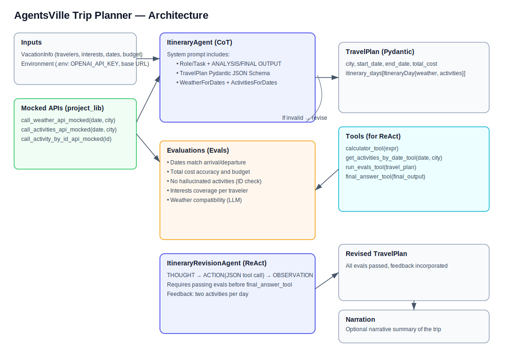

# AgentsVille Trip Planner (Notebook Guide)

Project 1 create an Agent to plan the perfect trip to the fictional city of AgentsVille applying modern LLM reasoning techniques. This project walks through:

- Role-based prompting (specialized planner roles)
- Chain-of-Thought (CoT) reasoning for itinerary design
- ReAct prompting (THOUGHT → ACTION → OBSERVATION)
- Feedback loops using evaluation tools (evals) and a revision agent
- Pydantic schemas for strongly-typed JSON I/O

All logic lives in the Jupyter Notebook:

- `Project_AgentsVille Trip PLanner/project_starter.ipynb`

The notebook uses mocked APIs (weather and activities) and a real LLM (OpenAI) to build, check, and revise a travel plan.

---

## Architecture diagram



---

## Contents

- Overview
- Prerequisites
- Setup (API key and environment)
- How to run (Windows PowerShell)
- Notebook walkthrough
- Key components and architecture
- Evaluations (Evals)
- ReAct revision loop
- Configuration/Customization
---

## Overview

I implemented two agents:

1) ItineraryAgent (CoT):
   - Crafts a day-by-day TravelPlan for the specified dates and budget using provided Weather + Activities context.
   - Outputs a strict JSON object conforming to a Pydantic schema (TravelPlan).

2) ItineraryRevisionAgent (ReAct):
   - Uses tools to evaluate and iteratively improve the plan.
   - Must pass all evals and incorporate traveler feedback (e.g., "at least two activities per day”).

also includes:
- Query mocked weather/activities data for a date window
- Enforce schemas with Pydantic
- Run evals to catch issues (budget mismatches, hallucinated events, bad weather matches, etc.)
- Close the loop with ReAct using tools (calculator, activities fetcher, eval runner, final answer)

---

## Prerequisites

- Python 3.10+ (recommended) (use 3.13.0)
- VS Code with Jupyter support 
- An OpenAI API key (required for LLM calls)

Notebook dependencies (installed in the first few cells):
- `json-repair`
- `numexpr`
- `openai`
- `pandas`
- `pydantic`
- `python-dotenv`


## Setup (API key and environment)


create a `.env` file at the repo root or the project folder with:

```
OPENAI_API_KEY=YOUR_OPENAI_KEY
# Optional override
# OPENAI_BASE_URL=https://api.openai.com/v1
```

The notebook loads `.env` automatically via `python-dotenv`.

---


## Notebook walkthrough


1) Initial Setup
   - Adds workspace path (if needed)
   - Installs dependencies
   - Initializes OpenAI client from environment variables

2) Define Vacation Details (Pydantic)
   - `VACATION_INFO_DICT` sample
   - Pydantic models: `Traveler`, `VacationInfo`
   - Validation ensures dates and required fields are correct

3) Review Weather and Activity Schedules (Mocked APIs)
   - `call_weather_api_mocked` for each date in the trip window
   - `call_activities_api_mocked` for each date
   - DataFrames to preview data

4) The ItineraryAgent (CoT)
   - Pydantic output models: `Weather`, `Activity`, `ActivityRecommendation`, `ItineraryDay`, `TravelPlan`
   - System prompt includes:
     - Role & Task
     - Output format with JSON example
     - TravelPlan JSON Schema (from Pydantic) to enforce structure
     - Context: inline WeatherForDates and ActivitiesForDates
   - `ItineraryAgent.get_itinerary(...)` calls the LLM and parses JSON into `TravelPlan`

5) Evaluating the Itinerary (Evals)
   - `get_eval_results(...)` helper and `EvaluationResults`
   - Evals include:
     - Dates match (arrival/departure)
     - Total cost accuracy
     - Total within budget
     - No hallucinated events (event-by-id check)
     - Interests satisfied per traveler
     - Weather compatibility (LLM-based check)
   - `ALL_EVAL_FUNCTIONS` aggregates these

6) Defining the Tools
   - `calculator_tool(expr)`
   - `get_activities_by_date_tool(date, city)`
   - `run_evals_tool(travel_plan)`
   - `final_answer_tool(final_output)`
   - Tool descriptions are derived from docstrings for the ReAct prompt

7) The ItineraryRevisionAgent (ReAct)
   - Traveler feedback text: "I want to have at least two activities per day."
   - A new eval checks that feedback is incorporated in the revised plan
   - ReAct system prompt enforces THOUGHT then exactly one ACTION as strict JSON:
     ```json
     {"tool_name": "run_evals_tool", "arguments": {"travel_plan": { /* ... */ }}}
     ```
   - Python loop repairs JSON if needed and routes tool calls; returns final `TravelPlan` when `final_answer_tool` is invoked

8) Final checks and display
   - Re-run all evals on the revised plan
   - Render day-by-day activities and an optional narrative summary

---

## Key components and architecture

- Pydantic models (strict JSON guardrails):
  - Input: `VacationInfo`
  - Output: `TravelPlan` (plus nested `ItineraryDay`, `Activity`, `Weather`)
- Mocked APIs (from `project_lib.py`):
  - `call_weather_api_mocked(date, city)`
  - `call_activities_api_mocked(date, city)`
  - `call_activity_by_id_api_mocked(activity_id)`
- LLM Client:
  - OpenAI client instantiated with `OPENAI_API_KEY` and optional `OPENAI_BASE_URL`
- Agents:
  - `ItineraryAgent` (single-shot CoT)
  - `ItineraryRevisionAgent` (multi-step ReAct with tools)
- Tools:
  - `calculator_tool`, `get_activities_by_date_tool`, `run_evals_tool`, `final_answer_tool`

---

## Evaluations (Evals)

Each eval raises an `AgentError` on failure, allowing the revision loop to diagnose and fix issues:

- Dates and ranges are consistent
- Sum of activity prices equals `total_cost`
- `total_cost` ≤ budget
- Itinerary events match real (mocked) events by ID
- Interests coverage across travelers
- Weather-activity compatibility via a compact LLM rubric
- Traveler feedback is fully incorporated (post-revision)

`run_evals_tool` returns a concise dict with `success` and `failures` to guide ReAct decisions.

---

## ReAct revision loop

- Prompt enforces: THOUGHT, then a single ACTION (JSON), then OBSERVATION (added by Python), repeat.
- Uses `json-repair` to tolerate minor JSON formatting hiccups from the LLM.
- Must call `run_evals_tool` before finalization and again to confirm success.
- Ends only when the LLM invokes `final_answer_tool` with a valid `TravelPlan`.

---

## Configuration/Customization

- Trip details: edit `VACATION_INFO_DICT` (travelers, destination, dates, budget, interests)
- Dates/City constraints: mocked data exists for AgentsVille from 2025-06-10 to 2025-06-15
- Model selection: defaults to `gpt-4.1-mini`; can switch to other models defined in `OpenAIModel`
- Cost/budget sensitivity: adjust budget and plan density to explore trade-offs
- Feedback: change `TRAVELER_FEEDBACK` to test different revision goals

---


